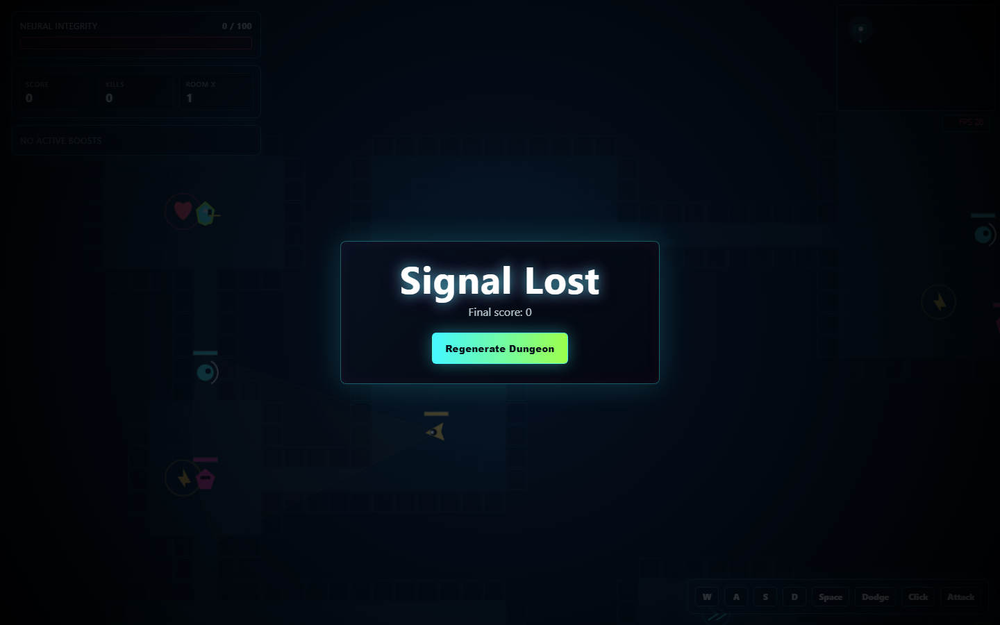
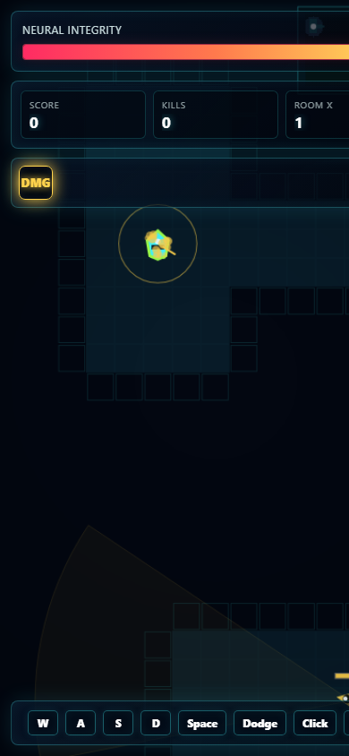

# Neural Dungeon

Neural Dungeon is a fast, dependency-free HTML5 Canvas dungeon crawler. The entire game is packaged in one HTML file and runs directly in a browser without a framework, package manager, build step, CDN, or external asset folder.

## Features

- Fullscreen real-time dungeon crawler rendered with the Canvas 2D API
- Procedural dungeon generation with BSP-style room splitting and carved corridors
- Randomized dungeon runs using browser-generated seed entropy
- Keyboard movement with `WASD` or arrow keys
- Mouse-based melee attacks and `Space` dodge movement
- Three enemy behavior types:
  - Grunts chase and attack in melee range
  - Archers keep distance and fire projectiles
  - Sentinels patrol rooms with directional vision cones
- A* pathfinding for enemy navigation
- Pickups for health, speed, and damage boosts
- Fog-of-war minimap with explored rooms, enemies, player position, and exit marker
- HUD for neural integrity, score, kills, room multiplier, active boosts, and FPS
- Win/death flow with dungeon regeneration
- Canvas particles, attack arcs, projectiles, screen shake, and responsive layout

## Screenshots

### Desktop Gameplay



### Mobile Layout



## Tech Stack

- HTML5
- CSS3
- JavaScript
- Canvas 2D API
- Web Crypto API
- Browser DOM events

## Folder Structure

```text
Neural Dungeon/
+-- neural-dungeon.html
+-- README.md
+-- .gitignore
+-- screenshots/
    +-- gameplay-desktop.png
    +-- gameplay-mobile.png
```

## Installation

Clone the GitHub repository:

```powershell
git clone https://github.com/muzzammilminhas/neural-dungeon.git
cd neural-dungeon
```

No dependency installation is required.

If you already have this folder locally, open `neural-dungeon.html` directly or use the PowerShell run command below.

## Run Commands

Open the game directly in your default browser:

```powershell
Start-Process ".\neural-dungeon.html"
```

Run with a local development server:

```powershell
python -m http.server 5500
```

Open the local server URL:

```powershell
Start-Process "http://localhost:5500/neural-dungeon.html"
```

## Controls

| Action | Control |
| --- | --- |
| Move | `WASD` or arrow keys |
| Attack | Left mouse click |
| Dodge | `Space` |
| Restart after win/death | `Regenerate Dungeon` button |

## Git Commands

Update GitHub with local changes:

```powershell
cd "D:\Muzammil\Misc\Projects & Dev\Neural Dungeon"
git status
git add README.md screenshots/gameplay-desktop.png screenshots/gameplay-mobile.png
git commit -m "Update README with screenshots"
git push origin main
```

Update your local project from GitHub:

```powershell
cd "D:\Muzammil\Misc\Projects & Dev\Neural Dungeon"
git status
git pull origin main
```

If Git says you have local changes before pulling, save them temporarily, pull, then restore them:

```powershell
git status
git stash push -m "Local work before pull"
git pull origin main
git stash pop
```

## Files That Should Not Be Pushed

The current project does not contain secret files, API keys, environment files, database files, dependency folders, or build output folders.

Do not commit these file types if they are added in future work:

- `.env` or `.env.*`
- API keys, tokens, credentials, or private config files
- Local database files such as `.db`, `.sqlite`, or `.sqlite3`
- Dependency folders such as `node_modules/` or `vendor/`
- Build output folders such as `dist/`, `build/`, or `out/`
- Local editor folders such as `.vscode/` or `.idea/`
- Logs, backups, temporary files, and compressed archives

## Repository

https://github.com/muzzammilminhas/neural-dungeon

## Author

Muzammil Minhas
